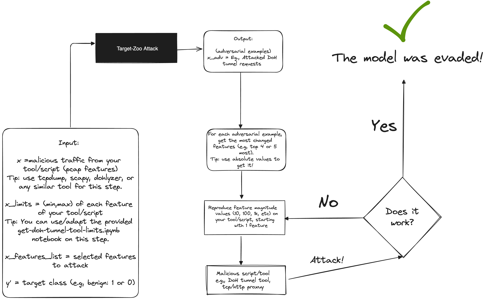

# DoH-Deception

Welcome to the DoH-Deception project! This repository contains the demonstrations/slides presented at BSidesLV 2024 and Defcon32.

## Generic Script to Attack Any ML Model Using Target Zoo Attack

## Attacking DoH Tunnel Detection Models - using Target Zoo Attack

### Presentations
- DEFCON32 - RTV: Soon!
- [BSIDESLV 2024](./BsidesLV_2024_presentation-DoHDecepetion.pdf)

## Demos

- Demo [README](./bsides-demos/README.md)

## Contact
For questions or further information, please reach out to:
- **Emanuel Valente** - [emanuel.valente@ifood.com.br](mailto:emanuel.valente@ifood.com.br)

