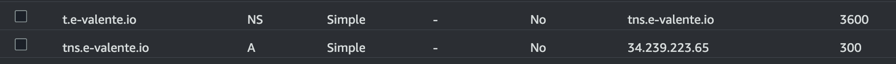

# BsidesLV - Demo

## Demo1 - DoH tunnel Basics - 101
In this demo, we will show how to create a DoH tunnel using dnstt on AWS and how to use it to tunnel DNS traffic over HTTPS.

Pre-requisites:
- An AWS account
- An Elastic IP (AWS)
- DNS domain configured in Route 53 (AWS)

### DNS Setup
Go into the AWS Route53 service console and add two records:

A	tns.yourdomain.com	points to	34.239.223.23 (Elastic IP)
NS	t.yourdomain.com	is managed by	tns.yourdomain.com

tns.yourdomain.com points to the addresses of your tunnel server. It is marked as being the nameserver for everything in the t.yourdomain.com DNS zone. 
When a recursive resolver receives a query for subdomain.t.yourdomain.com, it will forward the query to the tunnel server—that is how the client tunnels data to the server.

The "tns" and "t" labels can be anything you want, but the "tns" label should not be a subdomain of the "t" label (everything under that subdomain is reserved for tunnel payloads). 
The "t" label should be short, because there is limited space available in a DNS message, and the domain name takes up part of it.

Here is an example of screen capture of the Route 53 configuration:



### Steps
1. Create an EC2 instance (attacker machine) on AWS and attach a elastic IP on it.
2. Make sure the security group allows both TCP and UDP traffic on port 53
3. Install dnstt-server on the EC2 instance
- Clone the dnstt repository: https://github.com/Mygod/dnstt and compile the dnstt-server
- Generate a key pair for the DoH tunnel

```shell
./dnstt-server -gen-key -privkey-file server.key -pubkey-file server.pub
```

4. Create a DoH tunnel (server side)

```shell
./dnstt-server -udp :5300 -privkey-file server.key t.mydomain.com 127.0.0.1:8000
```

5. Create a backend "application" to receive the tunneled traffic on server side

```shell
ncat -l -k -v 127.0.0.1 8000
```

6. Configure the client (victim/local machine) to use the DoH tunnel
- Copy the public key `server.pub` to the client machine

Note: 1.1.1.1 is the Cloudflare DNS resolver. You can use any DoH resolver you want.

```shell
./dnstt-client -doh https://1.1.1.1/dns-query -pubkey-file server.pub t.mydomain.com 127.0.0.1:7000
```

7. Create a backend "application" to receive the tunneled traffic on client side

```shell
ncat -v 127.0.0.1 7000
````

8. Test the DoH tunnel
9. Analyze the traffic
10. Cleanup

## Demo 2 - Attacking DoH Tunnel Detection models    
In this demo, we will demonstrate how to attack DoH tunnel detection models using adversarial examples generated by the 
Zoo Attack (Vanilla) and Zoo Target Attack.
In the Zoo Vanilla attack, the success rate is high because the attack algorithm faces fewer constraints when generating 
adversarial examples.
Conversely, in the Zoo Target attack, the success rate is lower due to the increased constraints on the attack algorithm. 
However, it is important to note that despite the lower success rate, this attack is more realistic. 
In a real-world scenario, we just need a single successful attack instance to achieve the desired effect.

### Zoo Attack (Vanilla Attack)
1. Normalize data: [normalize-data.ipynb](./bsides-experiments/normalize-data.ipynb)
2. Train a model: [build_model.ipynb](./bsides-experiments/build_model.ipynb)
3. Generate adversarial examples (attack): [ZooDoH_Attack_GB.ipynb](./bsides-experiments/ZooDoH_Attack_GB.ipynb)

### Zoo Target Attack 
1. Normalize data: [normalize-data.ipynb](./bsides-experiments/normalize-data.ipynb)
2. Train a model: [build_model.ipynb](./bsides-experiments/build_model.ipynb)
3. Get DoH tunnel tools feature limits: [get-doh-tunnel-tool-limits.ipynb](./bsides-experiments/get-doh-tunnel-tool-limits.ipynb)
4. Increase/decrease the feature limits according to your needs: Edit the file `dnstt-limits-prod.csv`
5. Choose features to attack: Edit the array `features_to_attack` on notebook `Target_ZooDoH_Attack_GB.ipynb`
6. Generate adversarial examples (attack): [Target_ZooDoH_Attack_GB.ipynb](./bsides-experiments/Target_ZooDoH_Attack_GB.ipynb)

## Demo 3 - Real world Black Box Attacking (real-world scenario)   
In this demo, we will demonstrate how to attack DoH tunnel detection models using adversarial examples generated by the Target Zoo Attack in a real-world scenario.
The model is loaded by the [nids-ml.py](./feature-extractor/meter/nids-ml.py) script, simulating a real ML-based NIDS to detect DoH tunnel. The script captures the network traffic, normalize it and classifies it using the loaded model.
We use auxiliary scripts ([generate-tunnel-data](./tunel-dnstt/generate-tunnel-data.py) | [generate-attacked-tunnel-data](./tunel-dnstt/generate-attacked-tunnel.py)) to produce tunnel data and send it to the NIDS. 


## Feature extractor 

```shell
# meter module from dohlyzer
 python dohlyzer.py -n eno1 -c  ./output.csv

```

Note: Verify flow_session.py to change to NRT csv generation.

- Run the command line
```shell
 ./dohlyzer.py -m ../../../sbseg-experiments/models/ -s o

```

